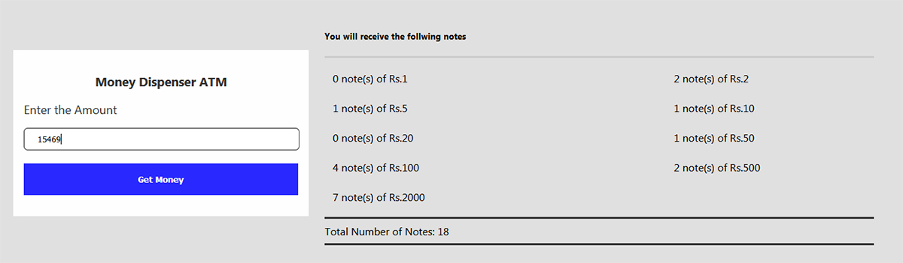

### React Money Dispencer
This is a toy app built using react library, which would calculate the least number of currency notes required to be dispenced by an ATM for an amount specified by the user.

### Screenshot

  

